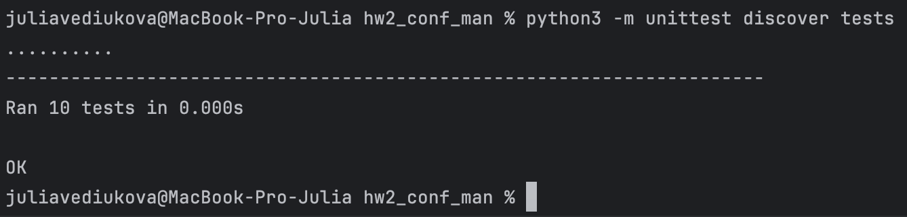

# Задание №3

Разработать инструмент командной строки для учебного конфигурационного языка, синтаксис которого приведен далее. Этот инструмент преобразует текст из входного формата в выходной. Синтаксические ошибки выявляются с выдачей сообщений.

Входной текст на учебном конфигурационном языке принимается из файла, путь к которому задан ключом командной строки. Выходной текст на языке json попадает в стандартный вывод.

### Однострочные комментарии:

C Это однострочный комментарий

### Многострочные комментарии:

```
(*
Это многострочный
комментарий
*)
```

### Словари:

```{
имя = значение,
имя = значение,
имя = значение,
...
}
```

### Имена:

```
6
[_a-z]+
```

### Значения:

• Числа.
• Словари.

## Объявление константы на этапе трансляции:

def имя = значение

## Вычисление константного выражения на этапе трансляции (постфиксная
форма), пример:

```
?[имя 1 +]
```

Результатом вычисления константного выражения является значение.

## Для константных вычислений определены операции и функции:

1. Сложение.
2. Вычитание.
3. Умножение.
4. Деление.
5. max().

## Все конструкции учебного конфигурационного языка (с учетом их возможной вложенности) должны быть покрыты тестами. Необходимо показать 2 примера описания конфигураций из разных предметных областей.

## Результаты тестов

